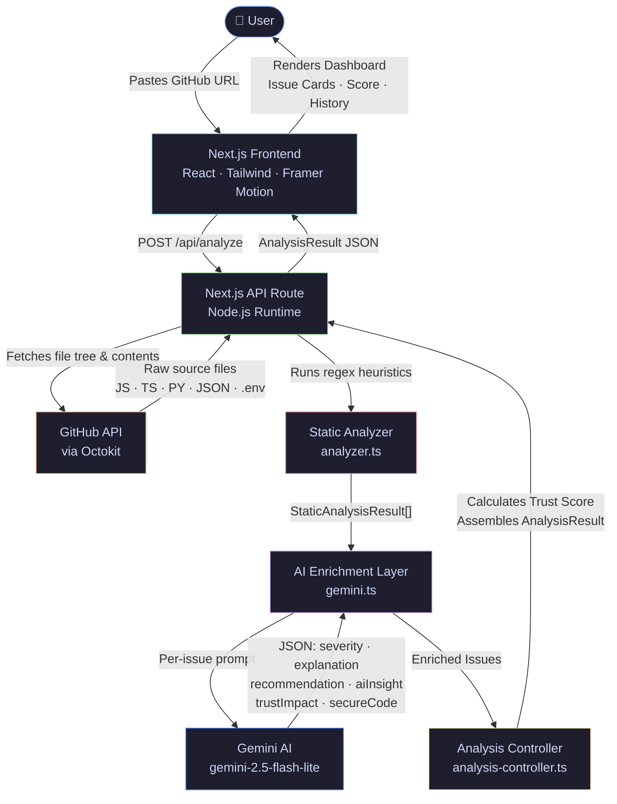

<div align="center">

<br/>

```
██╗   ██╗██╗ ██████╗ ██╗██╗     ██╗██╗  ██╗
██║   ██║██║██╔════╝ ██║██║     ██║╚██╗██╔╝
██║   ██║██║██║  ███╗██║██║     ██║ ╚███╔╝
╚██╗ ██╔╝██║██║   ██║██║██║     ██║ ██╔██╗
 ╚████╔╝ ██║╚██████╔╝██║███████╗██║██╔╝ ██╗
  ╚═══╝  ╚═╝ ╚═════╝ ╚═╝╚══════╝╚═╝╚═╝  ╚═╝
```

> **Trust infrastructure for AI-assisted development.**

*Scan. Score. Ship with confidence.*

---

## 🌐 Project Links

* 🔗 **Live Application**
  v[https://vigilix-ai.vercel.app](https://vigilix-ai.vercel.app/)

* 📦 **GitHub Repository**
  [https://github.com/yashvicoded/vigilix-ai.git](https://github.com/yashvicoded/vigilix-ai.git)


---

</div>

---

## The Problem

AI coding assistants — Copilot, Cursor, ChatGPT, Gemini — are now part of every developer's workflow. They write code fast. But they also:

- **Hallucinate packages** that don't exist — creating supply-chain attack vectors
- **Hardcode secrets** in examples and tutorials that get committed to real repos
- **Suggest deprecated or insecure patterns** with zero context about production risk
- **Skip error handling, auth guards, and input validation** for brevity
- **Generate code that looks correct** but fails silently at scale

The result? Developers ship code they don't fully understand into production. And the tooling to catch this barely exists.

> **AI accelerates shipping. Vigilix AI makes sure what you ship is safe.**
> 
> **The core issue isn't AI — it's the blind trust we place in its output.**


---

## Why Vigilix AI

There are linters. There are SAST tools. There are dependency scanners. But **NONE** of them are built around the specific failure modes of AI-generated code — **hallucinated** imports, **false** confidence, **shortcut** patterns, and the subtle **erosion** **of code ownership.**

**Vigilix AI is the first trust layer designed specifically for the AI-assisted development era.**

| Traditional Tools | Vigilix AI |
|---|---|
| Flag known CVEs | Flags AI-generated anti-patterns and hallucinations |
| Require CI/CD setup | Instant scan via GitHub URL — no setup |
| Produce technical SAST reports | Human-readable AI insights + secure rewrites |
| No AI context | Explains *why* AI likely generated the risk |
| Auth-gated and cloud-stored | Privacy-first, in-memory, local sessions |

---

## Core Features

**🛡️ AI Trust Score** 

Every scanned repository receives a 0–100 **Trust Score** — a composite metric calculated from severity, count, and trust impact of all detected issues.

| Score | Status |
|---|---|
| 80–100 | ✅ Safe to Ship |
| 50–79 | ⚠️ Needs Review |
| 0–49 | 🔴 Not Production Ready |

**🧠 Hallucination Detection**

Identifies imports of packages that don't exist on npm or PyPI — a hallmark failure of AI code generation. Phantom dependencies create silent runtime failures and open supply-chain attack surfaces.

**💡 Explainable Security Insights**

Every flagged issue comes with a plain-English explanation powered by Gemini AI — not just a rule ID. Developers understand *why* something is risky, not just *that* it's risky.

**🔧 Secure Rewrite Suggestions**

For each vulnerability, Vigilix AI generates a corrected, production-safe version of the problematic code. Diff-style display makes the fix immediately actionable.

**🔍 Multi-Vector Static Analysis**

The scanning engine checks for hardcoded secrets and API keys, dangerous function usage (`eval()`, `dangerouslySetInnerHTML`), insecure protocol calls (`http://`), hallucinated package imports, and XSS vulnerabilities.

**📊 Scan History Dashboard**
  
Track scans across repositories, compare trust scores over time, and maintain a full audit trail — stored locally on your device.

**🔒 Privacy-First Architecture**

Repositories are fetched, analyzed in-memory, and immediately discarded. No source code is ever stored on our servers.

**⚡ Zero-Setup GitHub Scanning**

Paste any public GitHub repository URL. No tokens, no integrations, no configuration files required.

---

## Screenshots

> 📸 _Screenshots and a live demo GIF will be added here._

<!--
| Landing Page | Repository Scan | Trust Dashboard |
|---|---|---|
|  |  |  |
-->

---

## Architecture Overview


---


## Demo Flow

**1 · Paste a GitHub URL**
Drop any public repository URL into the scanner. No signup. No OAuth. No configuration.

**2 · Vigilix AI scans and scores**
The pipeline fetches up to 20 source files, runs static analysis across 5 vulnerability categories, and enriches each finding with Gemini AI — generating severity ratings, human-readable explanations, and secure rewrites.

**3 · Review your Trust Report**
Your repository receives a Trust Score with a clear deployment status. Browse each flagged issue, read the AI insight, inspect the side-by-side diff, and understand exactly what to fix before you ship.

---

## Privacy-First Design

> **Vigilix AI never stores your source code.** This is not a caveat buried in fine print — it's an architectural commitment.

| Layer | Behavior |
|---|---|
| **Repository files** | Fetched via GitHub API, held in-memory per request, never persisted |
| **Analysis results** | Stored only in browser `sessionStorage` / `localStorage` — on your device |
| **Authentication** | Local device sessions — no user database, no third-party auth provider |
| **Server state** | Stateless Next.js API routes — each request is fully self-contained |

Your code stays yours. Vigilix AI processes it ephemerally and returns only the insights.

---

## Tech Stack

**Frontend**
- [Next.js 16](https://nextjs.org) — App Router, server components, API routes
- [React 19](https://react.dev) — Concurrent features, optimistic UI
- [TypeScript 5](https://www.typescriptlang.org) — End-to-end type safety
- [Tailwind CSS 4](https://tailwindcss.com) — Utility-first styling
- [Framer Motion](https://www.framer.com/motion/) — Fluid animations and transitions
- [Radix UI](https://www.radix-ui.com) — Accessible, unstyled component primitives
- [Recharts](https://recharts.org) — Trust score visualizations
- [Lucide React](https://lucide.dev) + [React Icons](https://react-icons.github.io/react-icons/) — Icon system

**Backend / Analysis Pipeline**
- [Node.js](https://nodejs.org) — Serverless runtime via Next.js API routes
- [@octokit/rest](https://github.com/octokit/rest.js) — GitHub API integration
- Custom static analysis engine — regex-based heuristics across 5 vulnerability categories
- [jsPDF](https://github.com/parallax/jsPDF) — Export scan reports as PDF

**AI Integration**
- [Google Gemini AI](https://deepmind.google/technologies/gemini/) (`gemini-2.5-flash-lite`) — Issue enrichment with structured JSON output via response schema
- `@google/generative-ai` SDK with constrained generation for reliable parsing

**Deployment**
- [Vercel](https://vercel.com) — Edge deployment, zero-config CI/CD
- [@vercel/analytics](https://vercel.com/analytics) — Privacy-respecting usage analytics

---

## Local Development

### Prerequisites

- Node.js ≥ 18
- A [Gemini API key](https://aistudio.google.com/app/apikey)
- A [GitHub Personal Access Token](https://github.com/settings/tokens) _(read-only, recommended for higher rate limits)_

### Installation

```bash
# 1. Clone the repository
git clone https://github.com/your-org/summer-internship-hackathon-2026-axios.git
cd summer-internship-hackathon-2026-axios

# 2. Install dependencies
npm install

# 3. Configure environment variables
cp .env.example .env.local

# 4. Start the development server
npm run dev
```

Open [http://localhost:3000](http://localhost:3000) in your browser.

### Environment Variables

```env
# .env.example

# Required — Google Gemini AI
GEMINI_API_KEY=your_gemini_api_key_here

# Recommended — GitHub API
# Avoids the 60 req/hr unauthenticated rate limit
GITHUB_TOKEN=your_github_personal_access_token_here
```

> [!NOTE]
> The app runs in **Demo Mode** without API keys. Live scanning requires a Gemini API key. A GitHub token is strongly recommended for reliable performance.

---

## Roadmap

Vigilix AI is designed to grow beyond a hackathon prototype into a serious developer security platform.

- [ ] **Deep AST Analysis** — Move beyond regex heuristics to parse abstract syntax trees for richer, context-aware detection
- [ ] **CI/CD Integration** — GitHub Actions workflow that blocks deployment when Trust Score falls below a configurable threshold
- [ ] **Pull Request Scanning** — Automatic analysis on every PR, with inline comments surfaced directly in the GitHub review interface
- [ ] **Private Repository Support** — OAuth-based GitHub auth to scan private repos with full access control
- [ ] **Dependency Hallucination Graph** — Visual map of all imports cross-referenced against npm, PyPI, and Maven
- [ ] **Trust Score Trends** — Track how a repository's security posture evolves across commits over time
- [ ] **VS Code Extension** — Real-time Vigilix AI analysis as you code, not just at scan time

---

## Made By

<div align="center">

**Team Axios 📡** 

**Yashvi Maharaj**

<br/>

*Built with focus, caffeine, and a genuine belief that AI-generated code needs a trust layer.*

</div>

---

<div align="center">

<sub>© 2026 Vigilix AI · Team Axios · MIT License</sub>

</div>
